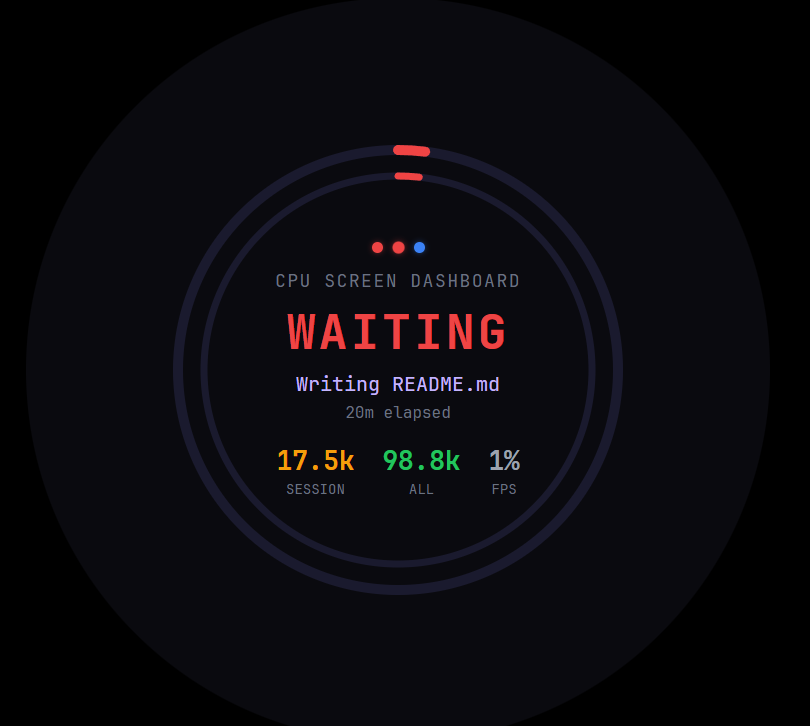

# Claude Cooler Dashboard

A real-time monitoring dashboard designed for 480x480px circular CPU cooler LCD screens (Corsair iCUE Elite LCD, AicUsbDisplay, etc.). It watches your active [Claude Code](https://claude.ai/code) sessions and displays live status, token consumption, rate limit headroom, and GPU utilization — all rendered inside concentric ring gauges on your cooler's screen.

<p align="center">
  
</p>

## What it shows

| Element | Description |
|---------|-------------|
| **Outer ring** | Rate limit consumption (green = healthy, amber = approaching limit) |
| **Inner ring** | Context window usage for the current session (approximate) |
| **Session dots** | Each dot is a Claude Code session (green = active, blue = waiting, purple = subagents, grey = idle) |
| **Center text** | Project name, status, current task, session duration |
| **Stats row** | Context window %, total tokens across all sessions, GPU utilization % |

The dashboard cycles through active sessions every 5 seconds and colour-codes everything by health state:

| Health | Meaning |
|--------|---------|
| **Green** | Sessions active, rate limit healthy (>30% remaining) |
| **Blue** | A session is mid-response (Claude is thinking) |
| **Amber** | Rate limit below 30%, or thinking for >2 minutes |
| **Red** | Session error |
| **Grey** | All sessions idle or none active (enters a breathing animation) |

## Architecture

```
~/.claude/projects/**/*.jsonl     (Claude Code session logs)
         |
   SessionWatcher  ------>  SessionParser
         |                       |
   RateEstimator           (token counts, status, task)
         |
   FpsCollector  --------->  nvidia-smi
         |
    StateManager  -------->  Aggregated state object
         |
    WebSocket (ws://localhost:7891)
         |
    Browser  -------->  480x480 Chrome kiosk window
```

The Node.js backend polls session data every 2 seconds and broadcasts state to all connected WebSocket clients. The frontend is a single HTML page with SVG ring gauges and vanilla JS — no frameworks.

## Prerequisites

- **Windows 10/11** (display detection uses `System.Windows.Forms`)
- **Node.js** v18+ ([download](https://nodejs.org/))
- **Google Chrome** (used in kiosk/app mode)
- **A 480x480 LCD cooler screen** connected as a secondary display
- **NVIDIA GPU** (optional, for GPU utilization — requires `nvidia-smi` on PATH)

## Installation

### 1. Clone the repository

```bash
git clone https://github.com/YOUR_USERNAME/cpu-screen-dashboard.git
cd cpu-screen-dashboard
```

### 2. Install dependencies

```bash
npm install
```

This installs:
- **chokidar** — file system watcher for session log changes
- **ws** — WebSocket server

### 3. Verify your cooler display is detected

Open PowerShell and run:

```powershell
Add-Type -AssemblyName System.Windows.Forms
[System.Windows.Forms.Screen]::AllScreens | ForEach-Object {
    "$($_.DeviceName): $($_.Bounds.Width)x$($_.Bounds.Height) at ($($_.Bounds.X), $($_.Bounds.Y))"
}
```

You should see a `480x480` entry in the list. Note the position coordinates — Chrome will be placed there automatically.

### 4. Test it manually

```powershell
powershell -ExecutionPolicy Bypass -File launch.ps1
```

This starts the Node.js backend and opens Chrome in kiosk mode on the cooler screen. If no 480x480 display is found, it will list available displays and exit.

To stop:

```powershell
powershell -ExecutionPolicy Bypass -File stop.ps1
```

### 5. Set up auto-start (Task Scheduler)

To launch the dashboard automatically at Windows login:

1. Open **Task Scheduler** (`Win+R` > `taskschd.msc`)
2. Click **Create Task** (not "Create Basic Task")
3. **General** tab:
   - Name: `Claude Cooler Dashboard`
   - Run only when user is logged on
   - Run with highest privileges (recommended)
4. **Triggers** tab:
   - New trigger > **At log on** > your user
   - Delay task for **30 seconds** (gives the cooler display time to initialise)
5. **Actions** tab:
   - Action: Start a program
   - Program: `powershell.exe`
   - Arguments: `-ExecutionPolicy Bypass -WindowStyle Hidden -File "C:\path\to\cpu-screen-dashboard\startup.ps1"`
   - Start in: `C:\path\to\cpu-screen-dashboard`
6. **Settings** tab:
   - Uncheck "Stop the task if it runs longer than..."
   - Check "Allow task to be run on demand"

Or create it via PowerShell (run as admin):

```powershell
$projectDir = "C:\path\to\cpu-screen-dashboard"

$action = New-ScheduledTaskAction `
    -Execute "powershell.exe" `
    -Argument "-ExecutionPolicy Bypass -WindowStyle Hidden -File `"$projectDir\startup.ps1`"" `
    -WorkingDirectory $projectDir

$trigger = New-ScheduledTaskTrigger -AtLogOn -User $env:USERNAME
$trigger.Delay = "PT30S"

$settings = New-ScheduledTaskSettingsSet `
    -AllowStartIfOnBatteries `
    -DontStopIfGoingOnBatteries `
    -StartWhenAvailable `
    -ExecutionTimeLimit (New-TimeSpan -Hours 0)

Register-ScheduledTask `
    -TaskName "Claude Cooler Dashboard" `
    -Action $action `
    -Trigger $trigger `
    -Settings $settings `
    -RunLevel Highest
```

Replace `C:\path\to\cpu-screen-dashboard` with your actual install path.

## Desktop shortcut

Run once to create a shortcut on your desktop:

```powershell
powershell -ExecutionPolicy Bypass -File create-shortcut.ps1
```

Double-clicking the shortcut launches the dashboard with a system tray icon. Right-click the tray icon for Start/Stop/Restart/Exit.

## System tray

The tray controller (`tray.ps1`) is the recommended way to run the dashboard:

- **Tray icon** appears in the system tray (notification area)
- **Right-click menu**: Start Dashboard, Stop Dashboard, Restart Dashboard, Exit
- **Double-click** the tray icon to start/restart
- Chrome window is **hidden from the taskbar** — it only shows on the cooler screen
- The tray process runs silently with no console window

The desktop shortcut, Task Scheduler startup, and manual launch all use the tray controller.

## Scripts

| Script | Purpose |
|--------|---------|
| `tray.ps1` | System tray controller with Start/Stop/Restart menu (recommended) |
| `launch.ps1` | Direct launch — backend + Chrome kiosk, no tray |
| `startup.ps1` | Auto-start at login — launches tray controller, logs to `startup.log` |
| `stop.ps1` | Kills backend and Chrome kiosk window |
| `create-shortcut.ps1` | Creates a desktop shortcut (run once) |

All scripts are safe to run multiple times — they check for existing processes before launching.

## Configuration

All settings are in `config.js`:

| Setting | Default | Description |
|---------|---------|-------------|
| `PORT` | `7891` | HTTP and WebSocket server port |
| `CLAUDE_DIR` | `~/.claude` | Claude Code data directory |
| `POLL_INTERVAL_MS` | `2000` | State broadcast interval (ms) |
| `SESSION_STALE_MINUTES` | `30` | Minutes before a session is marked idle |
| `THINKING_THRESHOLD_MS` | `120000` | Thinking duration (ms) before amber health |
| `MAX_SESSION_DOTS` | `5` | Max session indicators shown on screen |
| `ROTATION_INTERVAL_MS` | `5000` | Cycle between sessions every N ms |
| `RATE_LIMIT_WINDOW_MINUTES` | `60` | Rolling window for rate limit estimation |
| `RATE_LIMIT_CEILING_TOKENS` | `25000000` | Estimated Max 5x plan token ceiling |

### Adjusting the rate limit ceiling

The `RATE_LIMIT_CEILING_TOKENS` value is an estimate for the Claude Max 5x plan. If you're on a different plan or notice the outer ring is consistently inaccurate, adjust this value based on your observed throttling patterns.

## How it works

### Session detection

The backend watches `~/.claude/projects/` for `.jsonl` session log files using chokidar. Each Claude Code session writes events to these files in real time. The parser reads them to extract:

- **Status**: `THINKING` (Claude responding), `WAITING` (waiting for input), `IDLE` (no recent activity)
- **Token counts**: Summed from `usage.input_tokens` and `usage.output_tokens` across all events
- **Current task**: Extracted from the most recent tool use (e.g., "Editing server.ts", "Running npm build")
- **Session name**: Derived from the project directory path (e.g., `C--Users-User-Projects-MyApp` becomes `MYAPP`)

Subagent token usage (from `subagents/*.jsonl`) is automatically rolled into the parent session total.

### Context window usage

The inner ring and CTX stat show an approximation of how full the current session's context window is. This is calculated from the API's reported token usage (`input_tokens + cache_creation_input_tokens + cache_read_input_tokens`) and scaled by ~3.5x to account for overhead not captured in the JSONL logs (system prompts, tool schemas, MCP server definitions). The actual context window percentage shown by Claude Code's CLI is not exposed in a readable format, so this is a best-effort estimate. It will go up as conversations grow and drop after compaction.

### Rate limit estimation

Token consumption is tracked over a 60-minute rolling window. The estimator calculates what fraction of the ceiling has been consumed and displays the remaining capacity on the outer ring. If fewer than 3 data points have been collected, the ring shows a dashed pattern to indicate the estimate isn't reliable yet.

### GPU utilization

If an NVIDIA GPU is present, the backend polls `nvidia-smi` every 10 seconds for GPU utilization percentage. This is displayed in the stats row. If nvidia-smi isn't available, the value shows as `--`.

## Project structure

```
cpu-screen-dashboard/
├── server.js              # HTTP + WebSocket server (entry point)
├── config.js              # All configurable settings
├── tray.ps1               # System tray controller (recommended entry point)
├── launch.ps1             # Direct launch script (no tray)
├── startup.ps1            # Auto-start script (for Task Scheduler)
├── stop.ps1               # Shutdown script
├── create-shortcut.ps1    # Creates a desktop shortcut (run once)
├── dashboard.ico          # App icon for tray and shortcut
├── package.json
├── src/
│   ├── session-watcher.js # Watches ~/.claude/projects/ for changes
│   ├── session-parser.js  # Parses JSONL session logs
│   ├── state-manager.js   # Aggregates state, manages rotation
│   ├── rate-estimator.js  # Tracks token consumption vs ceiling
│   └── fps-collector.js   # Polls nvidia-smi for GPU stats
├── public/
│   ├── index.html         # Dashboard page (480x480)
│   ├── dashboard.js       # WebSocket client + rendering
│   ├── style.css          # Circular UI, ring gauges, animations
│   └── fonts/             # JetBrains Mono (woff2)
└── docs/
    └── superpowers/specs/
        └── 2026-03-19-claude-cooler-dashboard-design.md
```

## Troubleshooting

### Dashboard didn't start on boot

Check `startup.log` in the project directory — it records exactly what happened. Common causes:

- **Cooler display not ready**: The 30-second trigger delay should handle this. If not, increase the delay in Task Scheduler.
- **Node.js not on PATH**: The scheduled task runs in a limited environment. Ensure `node` is accessible system-wide.
- **Chrome not on PATH**: Same — ensure `chrome` is launchable from any directory.

### Dashboard shows "CONNECTING..."

The backend isn't running or isn't reachable on port 7891. Start it manually:

```bash
node server.js
```

### No sessions detected

- Make sure you have active Claude Code sessions (check `~/.claude/projects/` for `.jsonl` files)
- Sessions go idle after 30 minutes of inactivity and are pruned after 60 minutes

### Chrome window appears on the wrong monitor

The script auto-detects the 480x480 display by resolution. If you have multiple small displays, it picks the first match. You can hard-code the position in `launch.ps1` by replacing the detection logic with fixed `$x` and `$y` values.

## License

ISC
